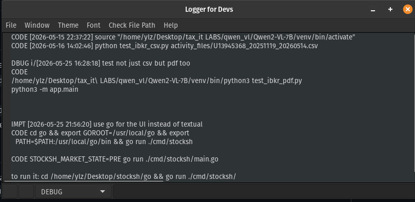

# Tree Logger

Tree Logger is a lightweight desktop logging tool for developers who want to capture what they are doing while they work. Instead of writing one long unstructured note, Tree Logger lets you add categorized entries such as debugging notes, implementation steps, solutions, errors, lessons, code notes, and trace points.

The app is built in C++ with wxWidgets and focuses on fast keyboard-driven logging. You can insert timestamps, choose a log category, write a short entry, and save everything to a plain text file for later review. It is useful as a personal development journal, debugging timeline, or lightweight work log.

## Features

- Categorized log entries for DEBUG, IMPLEMENTATION, SOLUTION, ERROR, FATAL, OBJECTIVE, LESSON, CODE, and TRACE notes.
- Short labels and color styling for each log category.
- Timestamp capture with `Ctrl+T`.
- Fast entry submission with `Shift+Enter`.
- Text file workflow with New, Open, Save, and Save As menu actions.
- Theme and font size menu controls.
- Keyboard focus shortcuts for the input field and category selector.

## Screenshot

## Tech Stack

- C++
- wxWidgets
- wxStyledTextCtrl
- Code::Blocks project file

## Project Files

- `App.cpp` / `App.h` starts the wxWidgets application.
- `MainFrame.cpp` / `MainFrame.h` contains the main logger window and menu actions.
- `SearchDialog.cpp` / `SearchDialog.h` contains the search dialog.
- `GUIDialog.cpp` / `GUIDialog.h` contains wxFormBuilder-generated dialog code.
- `Logger_V4.cbp` is the Code::Blocks project file.

## Build Notes

This project was created as a Code::Blocks wxWidgets project. To build it locally, install wxWidgets development packages and open `Logger_V4.cbp` in Code::Blocks.

On Linux, the project expects wxWidgets libraries similar to:

- `wx_gtk3u_core`
- `wx_gtk3u_stc`
- `wx_baseu`

The generated `bin/` and `obj/` folders are ignored by Git.
